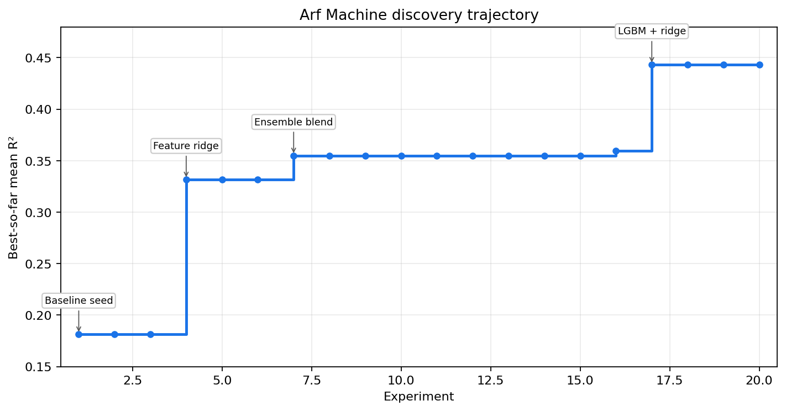
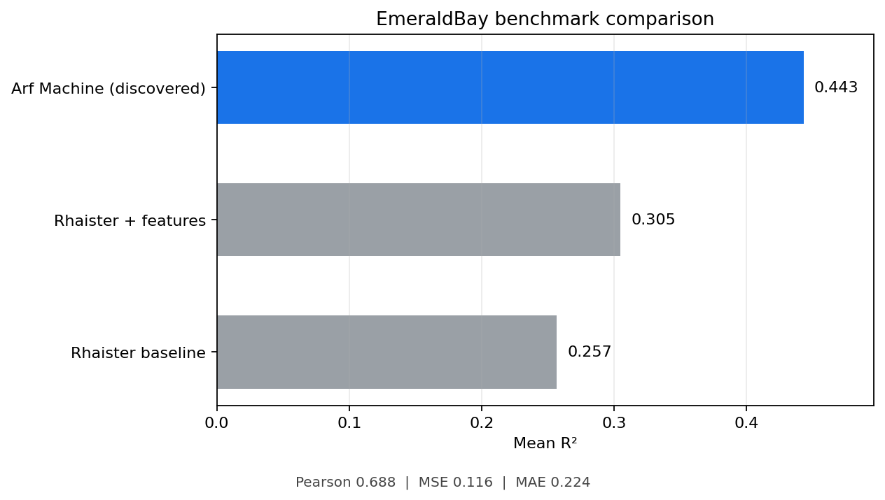
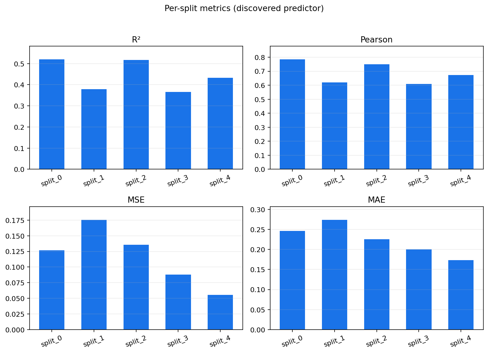
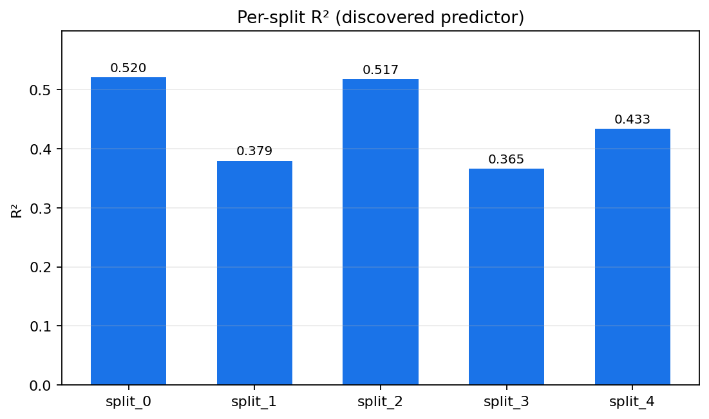

# Emerald Bay Drug Sensitivity Case

Nexgene AI's Arf Machine result on the Tahoe Emerald Bay drug sensitivity dataset, evaluated on the official held-out splits used by [Rhaister](https://huggingface.co/tahoebio/Rhaister), the proposed solution and baseline from the Rhaister authors.

Across roughly 20 autonomous experiments, Arf Machine discovered a deterministic predictor that reaches mean R² **0.443** and mean Pearson **0.687** across five Emerald Bay splits. The result improves on the published Rhaister feature baseline while keeping the final evaluation path as a single fit per split.

## Discovery Trajectory

The search moved from additive cell/drug effects through feature-augmented ridge models and ensemble refinements before converging on a compact LightGBM plus ridge-residual predictor.



## Headline Result



| Method | Mean R² | Mean Pearson | Mean MSE | Mean MAE |
| --- | ---: | ---: | ---: | ---: |
| Rhaister proposed solution | 0.257 | - | - | - |
| Rhaister proposed solution + features | 0.305 | - | - | - |
| Nexgene AI's Arf Machine | **0.443** | **0.687** | **0.116** | **0.224** |

## Per-Split Results



| Split | R² | Pearson | MSE | MAE |
| --- | ---: | ---: | ---: | ---: |
| split_0 | 0.520 | 0.785 | 0.127 | 0.246 |
| split_1 | 0.379 | 0.621 | 0.176 | 0.274 |
| split_2 | 0.517 | 0.749 | 0.136 | 0.225 |
| split_3 | 0.365 | 0.610 | 0.088 | 0.200 |
| split_4 | 0.433 | 0.673 | 0.056 | 0.173 |
| **mean** | **0.443** | **0.687** | **0.116** | **0.224** |

Worst-split R²: **0.365** (`split_3`).



## Why This Benchmark Matters

Emerald Bay is a pharmacogenomic screen with cell-line by drug growth-rate measurements and matched perturbational expression data. The task asks a model to predict held-out growth rates for unseen cell-line/drug combinations, a setting that matters for prioritizing compounds and understanding cell-specific drug response.

Rhaister is the authors' proposed solution for the filtered Emerald Bay task. It also provides the five official splits, published baseline scores, and feature artifacts used here, so Arf Machine progress is measured against the same held-out protocol rather than an ad-hoc random split.

**Data briefing:** see [DATA.md](DATA.md) for schema, provenance, filtering rules, feature blocks, and citation.

## What The Code Does

```text
cases/emeraldbay/
  README.md
  DATA.md                 # dataset briefing and local artifact contract
  main.py                 # discovered predictor
  data_bundle.py          # official split and feature loading
  benchmark_interface.py  # five-split evaluation harness
  requirements.txt
  env.example
  figures/
```

`main.py` exposes the predictor used by the benchmark harness:

```python
def predict_sensitivity(bundle: SplitBundle) -> np.ndarray:
    ...
```

`data_bundle.py` loads the official Rhaister splits and read-only feature blocks into a `SplitBundle`. `benchmark_interface.py` evaluates all five splits and reports aggregate plus per-split metrics.

## Scientific Notes

The headline predictor is a single-fit two-stage model per official split:

1. **LightGBM** over concatenated feature blocks (`mean_expr_2k`, `cell_eval`, `pdex`, `pdex_pv`, `pdex_fdr`) plus integer-encoded cell and drug identifiers.
2. **Ridge residual correction** over compact features: cell/drug IDs, additive cell/drug effects, and the in-sample LightGBM predictions.

Final test predictions are `lgb_pred + ridge_residual`, clipped to `[-1, 1]`. No inner cross-validation or multi-fold ensembling is used at inference time.

## Reproduce

This repository does **not** redistribute Emerald Bay data or Rhaister feature artifacts. To run the benchmark, prepare the Emerald Bay metadata/expression-derived artifacts and the Rhaister split repository locally, then point the case at those paths with `env.example`.

Expected local artifact layout when using defaults:

```text
data/
  emeraldbay/
    metadata/
      summary_statistics.parquet
      gene_metadata.parquet
  rhaister_data/
    EmeraldBay/
      growth_rate_long.parquet
      expression_means_2k.parquet
      cell_eval/all_delta.parquet
      pdex/all_pdex.parquet
  Rhaister/
    splits/EmeraldBay/
```

Install dependencies and evaluate:

```bash
cd cases/emeraldbay
pip install -r requirements.txt

python benchmark_interface.py
python benchmark_interface.py --json
```

On Windows PowerShell, set `$env:PYTHONUTF8 = "1"` before running Rhaister-backed evaluation code.

## Upstream References

- [Emerald Bay on Hugging Face](https://huggingface.co/datasets/tahoebio/EmeraldBay) - expression, metadata, summary statistics (CC BY 4.0)
- [Rhaister on Hugging Face](https://huggingface.co/tahoebio/Rhaister) - proposed solution, official splits, baselines, and feature pipeline
- [Loading tutorial notebook](https://huggingface.co/datasets/tahoebio/EmeraldBay/blob/main/tutorials/loading_data.ipynb)

## Acknowledgements

This case is built on the [Tahoe Emerald Bay](https://huggingface.co/datasets/tahoebio/EmeraldBay) pharmacogenomic dataset and the [Rhaister](https://huggingface.co/tahoebio/Rhaister) proposed solution. We thank Tahoe Bio for releasing Emerald Bay and the Rhaister authors for the curated splits and baseline evaluations.

## License

Code and documentation in this repository are released under the [MIT License](../../LICENSE).

Emerald Bay data and Rhaister feature artifacts are **not** redistributed here; obtain the dataset from [Hugging Face](https://huggingface.co/datasets/tahoebio/EmeraldBay) and the splits/features from Rhaister as linked above.
