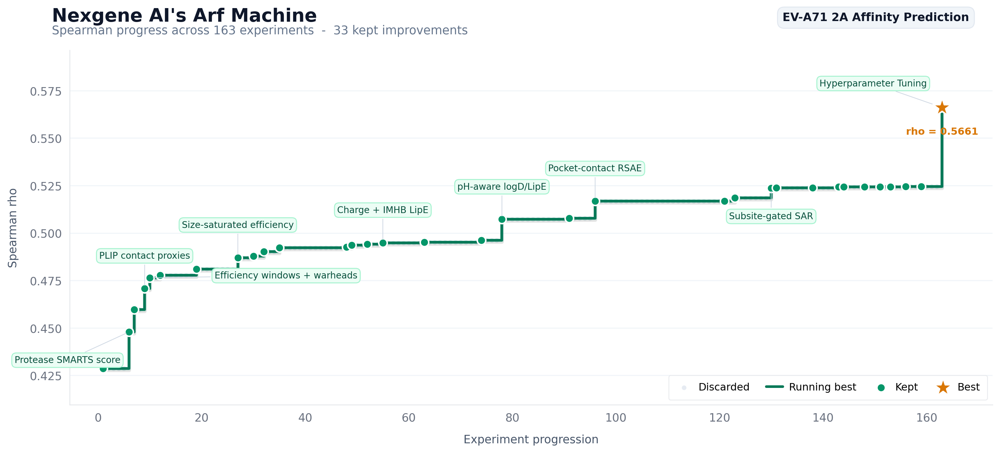
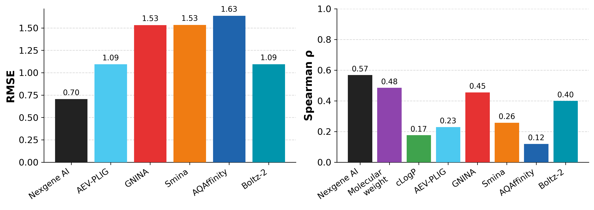

# OpenBind EV-A71 2A Affinity Case

Nexgene AI's Arf Machine result on the OpenBind EV-A71 2A protease affinity benchmark.

Arf Machine ran 163 autonomous experiments, kept 33 improvements, and produced an optimized deterministic predictor with Spearman rho `0.5661`, RMSE (root mean square error) `0.7011`, and pKD (-log10 of the dissociation constant) units on the curated OpenBind affinity benchmark.

## Discovery Trajectory

The most interesting part of this case is the search path. Arf Machine did not jump straight to the final formula; it accumulated small, held-out improvements that gradually separated potency from molecular size.



## Headline Result



| Method | Spearman rho | RMSE |
| --- | ---: | ---: |
| Nexgene AI's Arf Machine | 0.5661 | 0.7011 |
| Molecular weight | 0.483 | - |
| GNINA | 0.453 | 1.53 |
| Boltz-2 | 0.40 | 1.09 |
| Smina | 0.26 | 1.53 |
| AEV-PLIG | 0.23 | 1.09 |
| cLogP (calculated octanol-water partition coefficient) | 0.174 | - |
| AQAffinity | 0.12 | 1.63 |

The molecular-weight baseline was the hardest rank-correlation reference to beat. Most useful gains came from terms that reduced size bias while preserving local structure-activity signal.

## Why This Benchmark Matters

OpenBind's first public release is a dense structure-affinity dataset for structure-based AI. It contains 925 crystallographic binding events from 699 compounds, affinity measurements for 601 compounds, and a curated 494-compound affinity benchmark.

The target is EV-A71 2A protease, a viral cysteine protease relevant to antiviral discovery. The benchmark is valuable because it reflects a real experimental campaign: related compounds, uneven chemical coverage, receptor-state effects, and simple physicochemical baselines that are genuinely difficult to beat.

## What The Code Does

```text
cases/openbind/
  README.md
  main.py
  main_optimized.py
  benchmark_interface.py
  requirements.txt
  figures/
    openbind-affinity-benchmark.png
    arf-openbind-discovery-trajectory.png
```

- `main.py` is the best predictor discovered by the autonomous research loop before numeric refinement.
- `main_optimized.py` is the hyperparameter-refined predictor used for the headline result.
- `benchmark_interface.py` loads the OpenBind affinity reference table, calls a predictor, aggregates to compound level, and reports metrics.

Both predictors expose the same small API (application programming interface):

```python
def predict_affinity(compounds: pd.DataFrame) -> pd.DataFrame:
    ...
```

Input columns are `fragalysis_code` and `smiles`. Output columns are `fragalysis_code` and `predicted_affinity`.

## Scientific Notes

The optimized predictor is a deterministic pKD-like scoring function, not a neural network. It uses only compound identifiers and SMILES-derived features exposed to the predictor API, then combines ligand-efficiency, polarity, and local chemotype signals into a bounded affinity estimate.

The main modelling challenge was the molecular-weight baseline. In a same-target medicinal chemistry campaign, larger or more elaborated compounds can correlate with potency even when a model is not learning productive binding interactions. Arf Machine's useful improvements therefore focused on keeping size information but saturating it, then adding terms that reward efficiency, polarity satisfaction, and protease-relevant local SAR (structure-activity relationship).

```text
pKD_pred = clip(
    RSAE
    + contact_terms
    + gated_local_SAR
    + polarity_terms
    + calibration_terms,
    lower,
    upper
)
```

### Rigidity And Shape-Adjusted Efficiency (RSAE)

The `RSAE` backbone starts from coarse molecular descriptors such as molecular weight, heavy-atom count, ring count, aromaticity, rotatable bonds, heteroatom balance, and approximate 3D/shape proxies. These are arranged as efficiency-like terms so the predictor does not simply rank every larger compound higher. A topological rigidity index and flatness penalty further reduce false positives from floppy or overly planar scaffolds.

### pH-Aware logD (distribution coefficient at pH 7.4) And LipE (lipophilic efficiency)

These terms try to separate productive hydrophobic contribution from raw cLogP. Ionizable acids, bases, charged groups, and masked polarity can change the effective lipophilicity at assay pH. The predictor approximates this with rule-based ionization and LipE-like corrections, then penalizes cases where apparent potency would mostly come from hydrophobic size.

### IMHB-Aware Charge Handling

Not all polar atoms are equally costly. A donor or acceptor that can be internally masked by an intramolecular hydrogen bond (IMHB) behaves differently from exposed polarity. The model uses simple topological patterns to estimate IMHB masking and adjusts exposed-polar penalties accordingly. This avoids over-penalizing compounds whose polarity is structurally satisfied.

### Gated Local SAR And Protease SMARTS (SMILES arbitrary target specification)

Warhead-like motifs, nitriles, amides, heteroaryl groups, halogens, and related fragments can be useful in a cysteine-protease context, but unconditional fragment bonuses overfit quickly. The final predictor applies these small bonuses only when broader engagement and property-balance terms suggest the ligand is plausibly making productive contacts. The gating mechanism uses a sigmoid over contact-richness and engagement scores.

### Buried-Polar And Polarity-Frustration Penalties

These represent the opposite case: polar groups that appear costly without enough compensation from the binding environment. The terms are bounded and conservative, but they helped reduce false positives where size or lipophilicity looked favorable while polarity balance looked poor.

### Calibration Terms

Bounded scalar adjustments selected during the autonomous research loop and refined in the final hyperparameter pass. These do not introduce new features; they re-weight the contributions above within tight numerical bounds.

### Takeaway

The final gain came from layered, bounded corrections rather than one dominant feature. Arf Machine kept the useful part of size and efficiency, then added chemically interpretable terms for pH, polarity masking, local SAR, and pocket engagement.

## Run It

Install dependencies from the OpenBind case directory:

```bash
cd cases/openbind
uv pip install -r requirements.txt
```

Download the benchmark resources (this repository does not redistribute the dataset):

1. **Benchmark repo (required for this harness)** -- clone or download [OpenBind-Consortium/EV-A71_2A_benchmark](https://github.com/OpenBind-Consortium/EV-A71_2A_benchmark).
2. **Dataset release (reference)** -- [Zenodo (10.5281/zenodo.20026661)](https://zenodo.org/records/20026661).

Run the default optimized predictor:

```bash
uv run benchmark_interface.py \
  --benchmark-path /path/to/EV-A71_2A_benchmark
```

Evaluate the discovered predictor instead:

```bash
uv run benchmark_interface.py \
  --benchmark-path /path/to/EV-A71_2A_benchmark \
  --predictor main
```

Use the optimized predictor directly:

```python
import pandas as pd

from main_optimized import predict_affinity

compounds = pd.DataFrame(
    {
        "fragalysis_code": ["example"],
        "smiles": ["CC(=O)N"],
    }
)
predictions = predict_affinity(compounds)
```

## Roadmap

- [x] Discovered predictor (`main.py`)
- [x] Optimized predictor (`main_optimized.py`)
- [x] Benchmark scoring harness (`benchmark_interface.py`)
- [x] Figures and public case notes
- [ ] Experiment history
- [ ] Blog write-up

## Acknowledgements

This case is built on the [OpenBind](https://openbind.uk/) EV-A71 2A protease release. We thank the OpenBind consortium and [Diamond Light Source](https://www.diamond.ac.uk/) for generating and openly sharing these experimental data, and the [ASAP Discovery Consortium](https://asapdiscovery.org/) for coordinating the antiviral target selection.

## Citation

If you use the upstream dataset, please cite the OpenBind release:

> OpenBind Consortium. *OpenBind's first release: A structure-affinity dataset for structure-based AI.* 2026.
> DOI: [10.5281/zenodo.20026661](https://doi.org/10.5281/zenodo.20026661)

## License

Code and documentation in this repository are released under the [MIT License](../../LICENSE).

The upstream OpenBind dataset is licensed under CC0 1.0 Universal by the OpenBind consortium. The dataset is not redistributed in this repository; download it from the official [OpenBind release](https://openbind.uk/).
